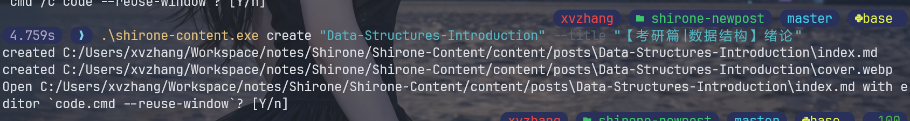
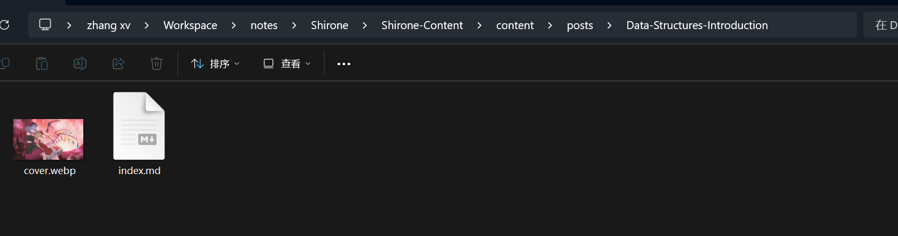

# shrncnt CLI

一个独立的 Rust 命令行工具，用于按 Shirone 项目约定创建模板文章。工具读取项目配置和用户模板，创建 `<slug>/index.md`，可选下载并转换头图为 `<slug>/cover.webp`，并在文章写入后按配置询问是否打开编辑器。

## 当前状态

第一阶段已达到可用于生产项目的文章创建能力：

- 从 `config.toml` 读取项目、默认 frontmatter、封面和编辑器配置。
- 使用模板创建单篇文章，支持多级 slug、命令行覆盖、`--dry-run` 和 `--force`。
- 校验 slug、文件名、时区和编辑器命令，避免在配置错误时写入文件。
- 以临时文件同步写入文章和封面，文章写入失败时恢复已有封面。
- 从图片接口下载图片并转换为 WebP。
- 编辑器支持跨平台 argv 解析、相对路径、`{file}` 占位符、等待模式和非交互终端隔离。
- `update`、`validate`、`publish` 和 `content` 子命令已保留入口，具体实现留待后续版本。

## 快速开始

```powershell
cargo run -- create guides/rust-cli --title "Rust CLI"
```

也可以使用兼容别名：

```powershell
cargo run -- new-post guides/rust-cli
```

运行目录应是 Shirone 项目根目录，或通过 `--root` 指定项目根目录。默认读取根目录下的 `config.toml`。

## 配置

### 配置文件位置与覆盖规则

默认情况下，工具把当前目录作为项目根目录，并读取 `<root>/config.toml`。也可以显式指定：

```powershell
shrncnt --root C:\work\shirone --config config.local.toml create notes/rust
```

路径规则如下：

1. `--root` 是所有项目相对路径的基准目录。
2. `--config`、`project.content_dir`、`project.template` 和带路径的编辑器可执行文件，使用相对 `--root` 的路径；绝对路径保持不变。
3. 创建命令的同名选项只覆盖本次运行，不修改 `config.toml`。
4. 配置在开始下载封面或写入文件前校验；文件名必须是单文件名，时区必须是有效的 IANA 时区，启用的编辑器命令必须可解析。

Windows 绝对路径建议使用 TOML 单引号（literal string）、正斜杠，或将反斜杠写成两个反斜杠：

```toml
# 推荐：单引号中的反斜杠不需要转义
content_dir = 'C:\Users\name\notes\Shirone-Content\content\posts'

# 也可以使用正斜杠
# content_dir = "C:/Users/name/notes/Shirone-Content/content/posts"

# 双引号写法必须将每个反斜杠成对写出
# content_dir = "C:\\Users\\name\\notes\\Shirone-Content\\content\\posts"
```

### 最小配置

如果使用默认目录、默认文件名和默认模板，只需设置项目需要改变的字段：

```toml
[project]
content_dir = "src/content/posts"
template = "templates/post.md"

[editor]
enabled = false
```

`filename` 默认是 `index.md`，`timezone` 默认是 `Asia/Shanghai`。模板文件必须实际存在；工具不会自动生成模板。

### 完整示例

```toml
[project]
content_dir = "src/content/posts"
template = "templates/post.md"
filename = "index.md"
timezone = "Asia/Shanghai"

[defaults]
draft = true
comment = true
description = ""
category = ""
tags = []
lang = ""

[cover]
enabled = false
endpoint = ""
timeout_seconds = 20
filename = "cover.webp"

[editor]
enabled = false
command = "code --reuse-window"
open_file = true
wait = false
```

### 字段说明

#### `[project]`

| 字段 | 作用 | 默认值 |
| --- | --- | --- |
| `project.content_dir` | 文章根目录 | `src/content/posts` |
| `project.template` | 文章模板路径 | `templates/post.md` |
| `project.filename` | 文章文件名，必须是单文件名 | `index.md` |
| `project.timezone` | 生成日期使用的 IANA 时区 | `Asia/Shanghai` |

最终文章路径为：`<root>/<content_dir>/<slug>/<filename>`。例如 `slug = guides/rust` 时，默认输出到 `src/content/posts/guides/rust/index.md`。

#### `[defaults]`

| 字段 | 作用 | 默认值 |
| --- | --- | --- |
| `defaults.draft` | 默认草稿状态 | `true` |
| `defaults.comment` | 默认评论开关 | `true` |
| `defaults.description` | 默认描述 | 空字符串 |
| `defaults.category` | 默认分类 | 空字符串 |
| `defaults.tags` | 默认标签数组 | `[]` |
| `defaults.lang` | 默认语言 | 空字符串 |

这些值会填充模板上下文；`--title`、`--tags` 等创建参数会覆盖对应值，仅对当前文章生效。

#### `[cover]`

| 字段 | 作用 | 默认值 |
| --- | --- | --- |
| `cover.enabled` | 是否默认下载头图 | `false` |
| `cover.endpoint` | 默认图片接口 URL | 空值 |
| `cover.timeout_seconds` | 图片请求超时秒数 | `20` |
| `cover.filename` | 头图文件名，必须是单文件名 | `cover.webp` |

封面启用规则：

- `cover.enabled = true`：每次创建都下载 `cover.endpoint`。
- `--cover`：只对本次创建启用封面。
- `--cover-url <URL>`：使用本次 URL，并自动启用封面。
- `--no-cover`：本次优先禁用封面。

启用封面时必须提供非空的 endpoint 或 `--cover-url`。下载内容会转换为 WebP，并写入 `<slug>/<cover.filename>`；文章中的图片值为 `./<cover.filename>`。

随机图请求在一次 `create` 流程中复用 HTTP Client，自动跟随 302 跳转，并对连接超时、连接失败、408、429 和 5xx 响应最多尝试 3 次，退避时间约为 200ms 和 500ms。响应体在读取前后均限制为 20 MiB，超过限制或无法解码为图片时本次创建直接失败，不会写入文章或头图文件。当前 endpoint 仍要求直接返回图片（可经过 302 跳转）；JSON 图片 URL 和本地缓存暂不参与解析。

#### `[editor]`

| 字段 | 作用 | 默认值 |
| --- | --- | --- |
| `editor.enabled` | 创建后是否进入编辑器确认流程 | `false` |
| `editor.command` | 编辑器命令及其参数 | 空字符串 |
| `editor.open_file` | 无 `{file}` 时是否自动追加文章绝对路径 | `true` |
| `editor.wait` | 是否等待编辑器进程结束 | `false` |

编辑器的三个常见配置方式：

```toml
# 图形编辑器：打开当前文章，启动后立即返回
[editor]
enabled = true
command = "code --reuse-window"
open_file = true
wait = false
```

```toml
# 终端编辑器：传入当前文章，并等待退出
[editor]
enabled = true
command = "nvim"
open_file = true
wait = true
```

```toml
# 只运行命令，不传入当前文章
[editor]
enabled = true
command = "code --reuse-window --new-window"
open_file = false
wait = false
```

`command` 使用跨平台 argv 解析，不经过 shell；单引号、双引号和空格参数均可用，但管道、重定向和 `&&` 不会被解释。没有路径分隔符的命令（例如 `code`、`nvim`）交给系统 `PATH` 查找；`tools/editor.exe`、`./tools/editor` 等相对可执行路径相对于 `--root`。

## 创建文章

基本命令：

```text
shrncnt create <slug> [options]
```

常用选项：

- `--title <TEXT>`：覆盖标题，未指定时由 slug 推导。
- `--description <TEXT>`、`--category <TEXT>`、`--tags <A,B>`、`--lang <LANG>`：覆盖 frontmatter 默认值。
- `--published YYYY-MM-DD`、`--published-at RFC3339`：覆盖日期；两者必须在配置时区中属于同一天。
- `--draft <true|false>`、`--comment <true|false>`：覆盖布尔字段。
- `--template <PATH>`、`--content-dir <PATH>`、`--filename <NAME>`：单次覆盖项目配置。
- `--cover`：本次启用封面下载；`--no-cover`：本次禁用封面。
- `--cover-url <URL>`：本次指定图片接口 URL。
- `--force`：覆盖已有文章；`--force-cover`：覆盖已有封面。
- `--dry-run`：只渲染并输出结果，不创建任何文件，也不启动编辑器。

例如：

```powershell
shrncnt --root . create notes/rust --title "Rust Notes" --tags rust,cli
shrncnt create "mathematical induction" --title "【考研篇|数学】数学归纳法"
shrncnt create photo --cover --cover-url "https://example.test/random"
shrncnt create preview --dry-run
```

`slug` 只能接收一个命令行参数；slug 含空格时必须用引号包住。未加引号的 `mathematical induction` 会被 shell 解析成两个参数。

目标文件为 `<root>/<content_dir>/<slug>/<filename>`。封面写入同一 slug 目录，Markdown 中的图片值为 `./<cover.filename>`。

## 编辑器行为

编辑器默认关闭。只有 `editor.enabled = true` 才会对每次创建进入确认流程；仅填写 `command` 不会触发提示。`--open` 可对单次创建强制启用已配置编辑器，`--editor <COMMAND>` 可替换本次命令并直接进入该命令的确认流程，`--no-open` 优先级最高并跳过确认与启动。

交互终端中的提示格式为：

```text
Open ... with editor `...`? [Y/n]
```

直接回车表示 `Y`，输入 `N` 或 `n` 跳过。stdin 或 stdout 不是交互终端时默认跳过编辑器，不读取输入，因此适合 CI 和管道任务。

编辑器命令使用跨平台 argv 解析：

- 支持单引号、双引号和带空格的参数，例如 `code --reuse-window "draft notes.md"`。
- 命令中包含 `{file}` 时，在其所在参数中替换为当前文章的绝对路径。
- 没有 `{file}` 且 `open_file = true` 时，自动追加当前文章绝对路径。
- `open_file = false` 时只执行命令本身，不追加文章路径。
- `wait = false` 启动后立即返回；`wait = true` 等待编辑器退出。
- 命令解析失败、启动失败或等待时返回非零只输出警告，已创建的文章和封面保留。

Windows 下 VS Code 通常安装为 `code.cmd`。如果 `code` 不在当前进程的 `PATH` 中，建议填写绝对路径，例如：

```toml
command = 'C:\Users\name\AppData\Local\Programs\Microsoft VS Code\bin\code.cmd --reuse-window'
```

也可以填写 `code` 或 `code.cmd`；程序会先按系统 `PATH` 查找。若使用相对可执行路径，则相对于 `--root` 解析。

参数优先级为：`--no-open` > `--editor` / `--open` > `editor.enabled`。`--open` 和 `--no-open` 互斥。`--editor` 只替换命令，`open_file` 与 `wait` 仍使用配置值。

查看完整参数：

```powershell
shrncnt create --help
```

## 模板变量

模板使用 Tera 语法。常用变量包括：

```text
{{ slug }}
{{ title }}
{{ published }}
{{ published_at }}
{{ description }}
{{ category }}
{{ lang }}
{{ draft }}
{{ comment }}
{{ image }}
{{ title_yaml }}
{{ description_yaml }}
{{ tags_yaml }}
```

`title_yaml`、`description_yaml` 和 `tags_yaml` 已按 YAML 规则转义，适合直接用于 frontmatter。项目可以复制或修改 `templates/post.md` 作为自己的模板。

## 保留命令

以下入口已集成 CLI，但当前只返回预留状态，便于后续扩展：

```text
shrncnt update <slug>
shrncnt validate
shrncnt publish
shrncnt content status|sync|watch|clean|export|eject|validate
```

Git 推送、内容仓同步、更新、校验和发布流程暂不执行实际操作。

## 开发与测试

```powershell
cargo fmt --all -- --check
cargo clippy --all-targets --all-features -- -D warnings
cargo test
```

集成测试使用临时目录和本地 HTTP 服务验证模板渲染、日期、封面转换、路径安全、dry-run 以及非交互编辑器行为。

## 演示——内容仓

个人配置：

```toml
[project]
content_dir = "C:/Users/xvzhang/Workspace/notes/Shirone/Shirone-Content/content/posts"
template = "templates/post.md"
filename = "index.md"
timezone = "Asia/Shanghai"

[defaults]
draft = false
comment = true
description = ""
category = ""
tags = []

[cover]
enabled = true
endpoint = "https://api.yppp.net/api.php"
timeout_seconds = 20
filename = "cover.webp"

[editor]
# Set enabled = true to prompt before opening every newly-created article.
# Use {file} to control the file argument; otherwise open_file controls it.
enabled = true
command = "code.cmd --reuse-window"
open_file = true
wait = false
```

模板：

```markdown
---
title: {{ title_yaml }}
published: {{ published }}
publishedAt: {{ published_at }}
description: {{ description_yaml }}
image: {{ image_yaml }}
tags:
{{ tags_yaml }}
category: {{ category_yaml }}
draft: {{ draft }}
comment: {{ comment }}
lang: {{ lang_yaml }}
---

```

命令：

```powershell
.\shrncnt.exe create "Data-Structures-Introduction" --title "【考研篇|数据结构】绪论"
```






